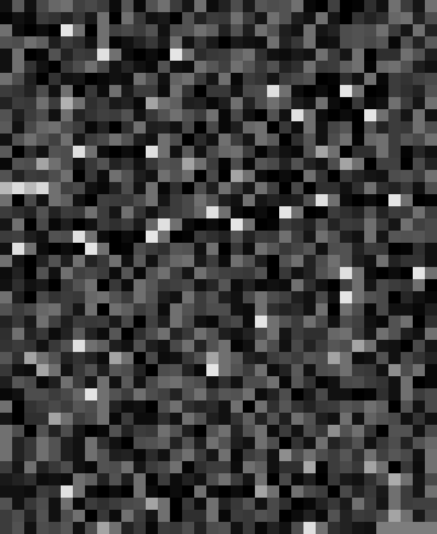
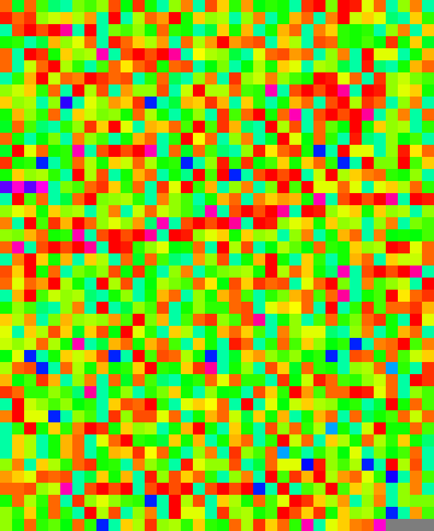
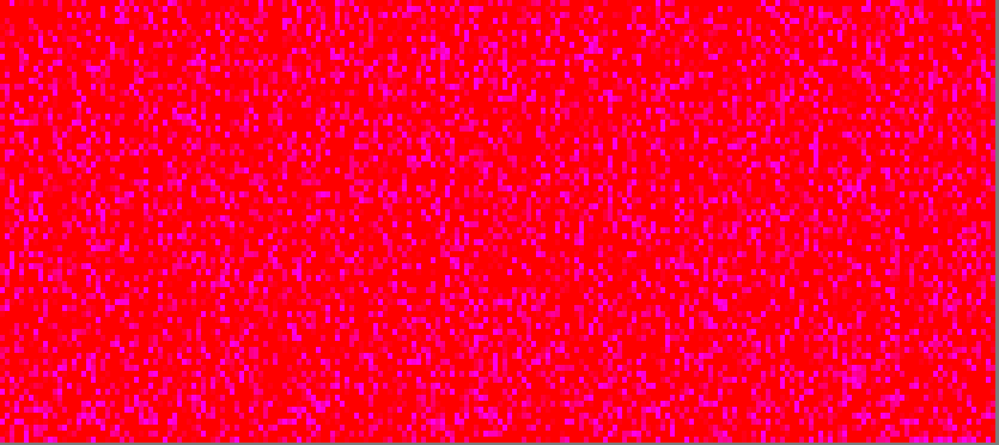
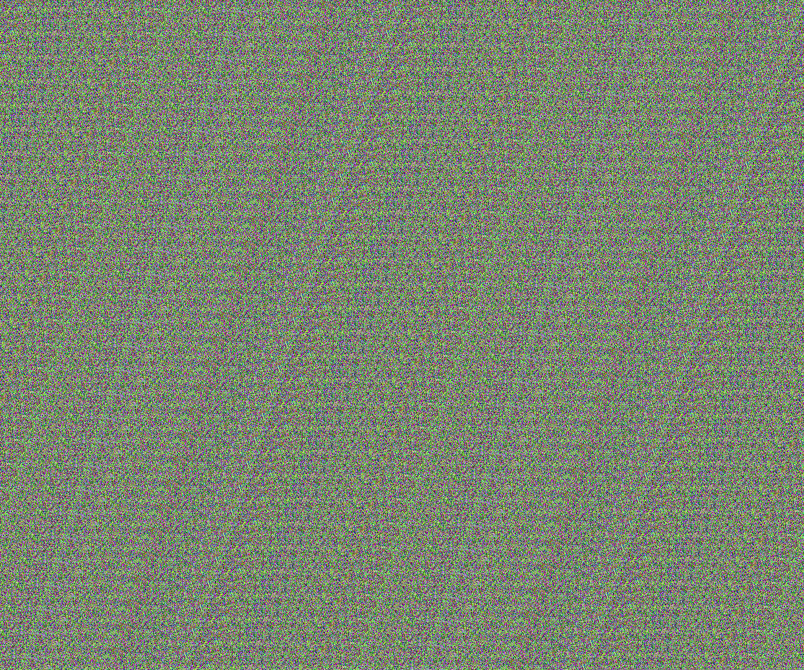

# Thought Compiler

The goal here is to provide representations of language that are capable of being understood without effort by a human mind or knowledge of any language. 

A compiler is meant to perform a transformation from a high-level source program understood by a programmer to a low-level target program understood by the machine. I wrote this program with the intention of using it as a "compiler" for my journal entries, transforming them from written language to color.

Like a high-level programming language, language is something that is understood by those who use it. It requires a certain amount of cognitive effort to engage with a language. Here I am trying to "compile" my use of language to an assembly-like representation for the human mind, capable of being understood without knowledge of a language. It is in this way that I attempt to treat the mind like a computer, breaking down language into a simpler form that all minds can understand.

To show an example of what the program can produce, I will use a section titled "Dadaist Disgust" from Tzara's *Dada Manifesto 1918*:
>Every product of disgust capable of becoming a negation of the family is Dada; a protest with the fists of its whole being engaged in destructive action: Dada; know ledge of all the means rejected up until now by the shamefaced sex of comfortable compromise and good manners: Dada; abolition o/ logic, which is the dance of those impotent to create: Dada; of every social hierarchy and equation set up for the sake of values by our valets: Dada: every object, all objects, sentiments, obscurities, apparitions and the Tzara, “Dada Manifesto 1918” precise clash of parallel lines are weapons for the fight: Dada; abolition of memory: Dada; abolition of archaeology: Dada; abolition of prophets: Dada; abolition of the future: Dada; absolute and unquestionable faith in every god that is the immediate product of spontaneity: Dada; elegant and unprejudiced leap from a harmony to the other sphere; trajectory of a word tossed like a screeching phonograph record; to respect all individuals in their folly of the moment: whether it be serious, fearful, timid, ardent, vigorous, determined, enthusiastic; to divest one's church of every useless cumbersome accessory; to spit out disagreeable or amorous ideas like a luminous waterfall, or coddle them—with the extreme satisfaction that it doesn't matter in the least—with the same intensity in the thicket of core's soul pure of insects for blood well-born, and gilded with bodies of archangels. Freedom: Dada Dada Dada, a roaring of tense colors, and interlacing of opposites and of all contradictions, grotesques, inconsistencies: LIFE

Using the color settings that are currently in the program (RGB(i, i, i)), we get the following:

  

If we tweak the settings to be HSB(i, numChars, numChars), we get something quite different:

  

If we slide the gamut all the way to the right with HSB(i+50, numChars, numChars), we can assign 50 of the colors to red (59) and 9 of them to colors preceeding red to get some pretty impressive depth (any number over 59 gets assigned 59). Note that I am using the entirety of *Dada Manifesto 1918* in this example:

  

Now, If we want to get *really* crazy we can change the color settings to RBG(random(numChars), random(numChars), random(numChars)) (random color for each character), make letterWidth = letterHeight = 1, and use a 1286711 character input (in this case I took the same 22977 character input and repeated it):

  

One can imagine that with a large enough input, an image (or more likely, very interesting muddy grey) can be created by these pixels

 
 
 

I was inspired to create this after seeing ['Color Typewriter' by John Maeda](https://www.ntticc.or.jp/en/archive/works/color-typewriter/) and ['Dither Studies: Hand Renders' by Daniel Temkin](https://danieltemkin.com/DitherStudies/HandRenders/). The program itself is a heavily modified adaptation of [Keyboard Functions by Martin Gomez](https://processing.org/examples/keyboardfunctions.html)
